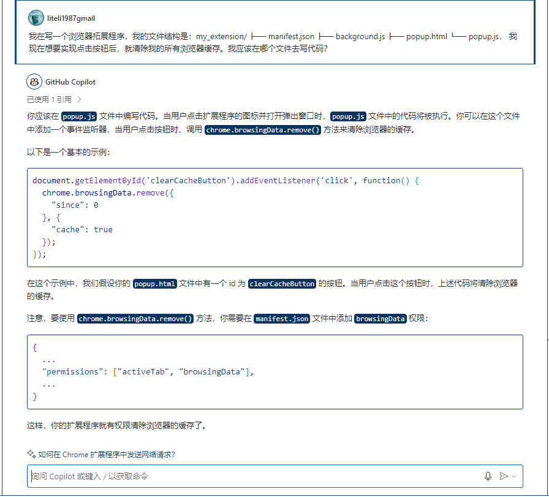
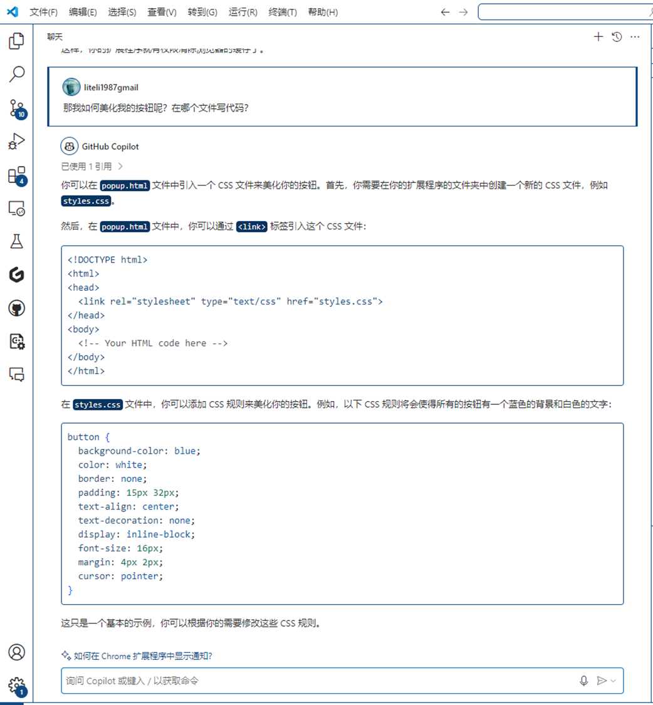
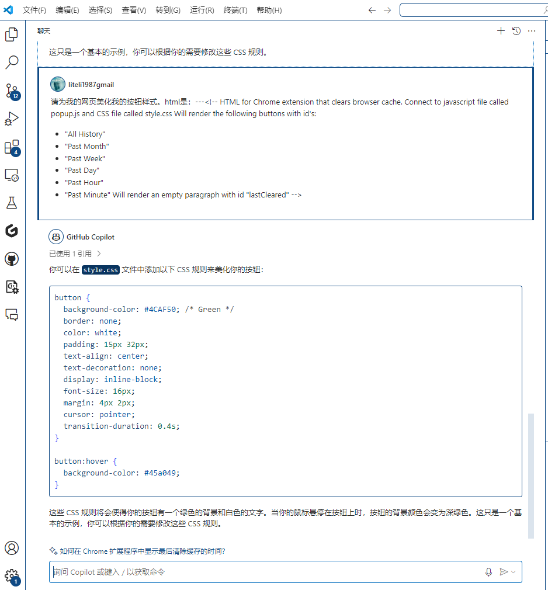
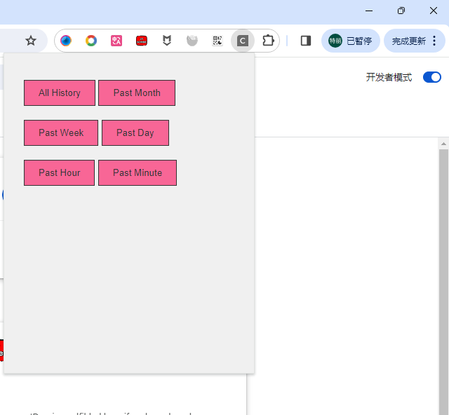
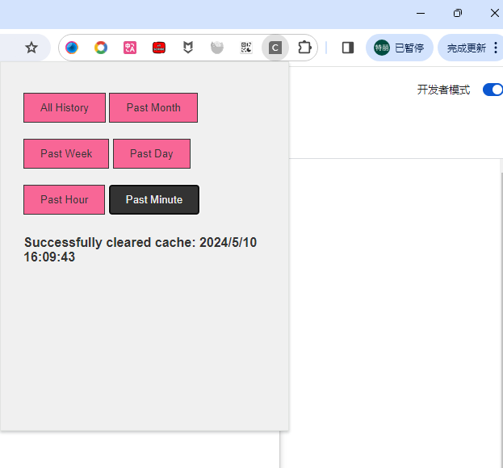

## 提示词

1. ME: 使用聊天窗口，我问 GitHub Copilot，“如何创建 Chrome 扩展程序？文件结构应该是什么样子的。
Copilot回答： 
```
创建 Chrome 扩展程序需要以下几个步骤：

1. 创建一个新的文件夹来存放扩展程序的文件。
2. 在这个文件夹中，创建一个名为 `manifest.json` 的文件。这是扩展程序的主要配置文件，它告诉 Chrome 扩展程序的名称、版本、所需权限等信息。
3. 创建一个或多个 JavaScript 文件来实现扩展程序的功能。这些文件可以在 `manifest.json` 文件中通过 `background` 或 `content_scripts` 字段引用。
4. 创建一个或多个 HTML 文件来作为扩展程序的用户界面。这些文件可以在 `manifest.json` 文件中通过 `browser_action` 或 `page_action` 字段引用。
5. 可以创建一个或多个 CSS 文件来美化扩展程序的用户界面。

以下是一个基本的 Chrome 扩展程序的文件结构：

```
my_extension/
├── manifest.json
├── background.js
├── popup.html
└── popup.js
```

这是 `manifest.json` 文件的一个基本示例：

```json
{
  "manifest_version": 2,
  "name": "My Extension",
  "version": "1.0",
  "description": "A simple Chrome Extension",
  "browser_action": {
    "default_popup": "popup.html"
  },
  "permissions": ["activeTab"],
  "background": {
    "scripts": ["background.js"],
    "persistent": false
  }
}
```

在这个示例中，`background.js` 是后台脚本，`popup.html` 和 `popup.js` 是弹出窗口的 HTML 和 JavaScript 文件。
```
人类行为： 我们按照文件结构，新建立了四个文件。

2. 在manifest.json的文件顶部写入提示词，描述这个浏览器拓展想要达成的目标：
```
清除浏览器缓存的 Chrome 扩展程序的Manifest文件。
Manifest版本：3
扩展程序的权限包括：storage（存储）、tabs（标签页）、browsingData（浏览数据）
```
输入一对花括号来，在括号中间键入回车键后，自动调用 GitHub Copilot 的建议。
在花括号内，GitHub Copilot 建议了代码片段，以斜体显示，键入Tab键确认接受这个代码。我删除了描述我想要manifest.json的行，最终文件如下所示：

```
{
    "manifest_version": 3,
    "name": "Clear Cache",
    "version": "1.0",
    "permissions": [
        "storage",
        "tabs",
        "browsingData"
    ],
    "action": {
        "default_popup": "popup.html",
    }
}
```
你一定看见了顶部提示词报错的红色波浪线，记得删除这个步骤的提示词，只留下花括号开始的代码。你可以选中这些提示词注释，点击右键请它修复，它会帮你将这段注释删除。

3. 在我的background.js文件中，使用/* */注释一下我们的提示词，这样可以不用执行删除提示词的步骤，这个提示词描述了我想要的服务工作者：
```
/*
服务工作线程用于 Google Chrome 扩展程序
需处理扩展程序安装时的情况
需处理接收到消息时的情况
*/
```
注意：/* */ 这个配对符号是Javascript语言代表多行注释的符号。// 符号是单行注释。代码文件的注释不会影响程序的执行和数据。

输入提示词的注释后，键入回车空一行，当光标在新一行的行首跳动时，Copilot就开始工作了。它首先写入注释，"// When extension is installed"。

键入Tab键确认接受这个注释后，马上又写入了新的代码片段,`chrome.runtime.onInstalled.addListener` 函数。我们只要键入Tab键确认接受。

重复回车空一行，键入Tab键确认接受代码后，这一步的完整代码如下：

```
/*
服务工作线程用于 Google Chrome 扩展程序
需处理扩展程序安装时的情况
需处理接收到消息时的情况
*/

// When extension is installed
chrome.runtime.onInstalled.addListener(() => {
    console.log('Extension Installed');
});

// When message is received
chrome.runtime.onMessage.addListener((message, sender, sendResponse) => {
    console.log('Message Received');
    console.log(message);
    sendResponse('Message Received');
});
```

background.js使扩展能够在后台运行、执行任务以及响应扩展弹出窗口之外的用户事件（如网络请求和数据存储）。

4. 在popup.html文件中，写入一个多行注释的提示词，描述希望弹出窗口如何显示。此窗口是用户单击扩展图标时将看到的窗口。

```
<!-- 
   用于清除浏览器缓存的 Chrome 扩展程序的 HTML。
   连接到名为 popup.js 的 JavaScript 文件和名为 style.css 的 CSS 文件
   将呈现以下带有 ID 的按钮：
   - "All History"
   - "Past Month"
   - "Past Week"
   - "Past Day"
   - "Past Hour"
   - "Past Minute"

   将呈现一个带有 ID "lastCleared" 的空段落
-->
```
在 HTML 文件中，注释是通过 <!-- 开始，以 --> 结束的。这种方式允许你添加不会被浏览器解析的注释内容。而在 JavaScript 文件中，注释可以使用两种方式：单行注释，使用 // 开头：多行注释，使用 /* 开头，以 */ 结束。在大多数编程语言中，快捷键来生成注释通常是一致的。对于单行注释，通常都是 Ctrl + /（在 Windows/Linux 上）或 Cmd + /（在 macOS 上）。

键入回车后，新起一行，Copilot的代码建议以斜体字体出现，`<!DOCTYPE html>`。我们继续键入Tab键确认接受代码。这一步的完整代码如下：

```
<!DOCTYPE html>
<html>
  <head>
    <link rel="stylesheet" type="text/css" href="style.css">
  </head>
  <body>
    <button id="All History">All History</button>
    <button id="Past Month">Past Month</button>
    <button id="Past Week">Past Week</button>
    <button id="Past Day">Past Day</button>
    <button id="Past Hour">Past Hour</button>
    <button id="Past Minute">Past Minute</button>
    <p id="lastCleared"></p>
    <script src="popup.js"></script>
  </body>
</html>
```
5. 测试浏览器扩展程序。

在 Chrome 浏览器中导航到 chrome://extensions/。开启右上角的开发者模式按钮。点击左上角的“上传已解压缩文件”，
上传包含 Chrome 扩展程序的文件夹。加载后，点击浏览器的顶部菜单栏的拓展图标（拼图样式），列表第一个就是我们刚刚上传的程序。

试试点击，其中一个按钮，什么都没发生。这是正常的，因为我们并没有写任何交互性的代码。下一步我们让Copilot写入交互的代码。

6. 在popup.js文件顶部添加提示词，告诉Copilot我们想要的交互效果。当我们想要实现的功能、样式、交互事件，不知道写入哪个文件时，我们可以在Copilot Chat界面询问，“我在写一个浏览器拓展程序，我的文件结构是：....， 我现在想要实现...我应该在哪个文件去写代码？”


Copilot的回答为我们指名了方向，原来是要在popup.js里面写。

打开popup.js文件，输入注释格式的提示词。

```
/* 
本程序是一个用于清除浏览器缓存的 Chrome 扩展程序。
处理按钮点击事件：
- ID 为 "allHistory" 的按钮用于清除所有缓存历史记录
- ID 为 "pastMonth" 的按钮用于清除过去一个月的缓存历史记录
- ID 为 "pastWeek" 的按钮用于清除过去一周的缓存历史记录
- ID 为 "pastDay" 的按钮用于清除过去一天的缓存历史记录
- ID 为 "pastHour" 的按钮用于清除过去一小时的缓存历史记录
- ID 为 "pastMinute" 的按钮用于清除过去一分钟的缓存历史记录

创建函数以实现：
- 将日期和时间转换为人类可读的格式
- 在 ID 为 "lastCleared" 的段落中添加 "成功清除缓存" 及日期和时间
*/
```

继续重复之前的二个回车唤起它，一个Tab键接受代码，直到它输出“// Path: build-a-browser-extension/manifest.json”。意味着任务已经完成了。此时它写入了100多行代码。看函数的名字，大概理解它是在监听点击，点击之后删除缓存。

在我执行的时候，它还给我写了几个没有用的函数，我把它删除了，你可以删除也可以忽略它。

完整的代码如下：

```

document.getElementById('allHistory').addEventListener('click', () => {
    chrome.browsingData.remove({}, {
        "appcache": true,
        "cache": true,
        "cookies": true,
        "downloads": true,
        "fileSystems": true,
        "formData": true,
        "history": true,
        "indexedDB": true,
        "localStorage": true,
        "pluginData": true,
        "passwords": true,
        "serviceWorkers": true,
        "webSQL": true
    }, () => {
        console.log('Cache Cleared');
        document.getElementById('lastCleared').innerHTML = 'Successfully cleared cache: ' + new Date().toLocaleString();
    });
}
);

document.getElementById('pastMonth').addEventListener('click', () => {
    chrome.browsingData.remove({
        "since": (new Date().getTime() - 2592000000)
    }, {
        "appcache": true,
        "cache": true,
        "cookies": true,
        "downloads": true,
        "fileSystems": true,
        "formData": true,
        "history": true,
        "indexedDB": true,
        "localStorage": true,
        "pluginData": true,
        "passwords": true,
        "serviceWorkers": true,
        "webSQL": true
    }, () => {
        console.log('Cache Cleared');
        document.getElementById('lastCleared').innerHTML = 'Successfully cleared cache: ' + new Date().toLocaleString();
    });
}
);

document.getElementById('pastWeek').addEventListener('click', () => {
    chrome.browsingData.remove({
        "since": (new Date().getTime() - 604800000)
    }, {
        "appcache": true,
        "cache": true,
        "cookies": true,
        "downloads": true,
        "fileSystems": true,
        "formData": true,
        "history": true,
        "indexedDB": true,
        "localStorage": true,
        "pluginData": true,
        "passwords": true,
        "serviceWorkers": true,
        "webSQL": true
    }, () => {
        console.log('Cache Cleared');
        document.getElementById('lastCleared').innerHTML = 'Successfully cleared cache: ' + new Date().toLocaleString();
    });
}
);

document.getElementById('pastDay').addEventListener('click', () => {
    chrome.browsingData.remove({
        "since": (new Date().getTime() - 86400000)
    }, {
        "appcache": true,
        "cache": true,
        "cookies": true,
        "downloads": true,
        "fileSystems": true,
        "formData": true,
        "history": true,
        "indexedDB": true,
        "localStorage": true,
        "pluginData": true,
        "passwords": true,
        "serviceWorkers": true,
        "webSQL": true
    }, () => {
        console.log('Cache Cleared');
        document.getElementById('lastCleared').innerHTML = 'Successfully cleared cache: ' + new Date().toLocaleString();
    });
}
);

document.getElementById('pastHour').addEventListener('click', () => {
    chrome.browsingData.remove({
        "since": (new Date().getTime() - 3600000)
    }, {
        "appcache": true,
        "cache": true,
        "cookies": true,
        "downloads": true,
        "fileSystems": true,
        "formData": true,
        "history": true,
        "indexedDB": true,
        "localStorage": true,
        "pluginData": true,
        "passwords": true,
        "serviceWorkers": true,
        "webSQL": true
    }, () => {
        console.log('Cache Cleared');
        document.getElementById('lastCleared').innerHTML = 'Successfully cleared cache: ' + new Date().toLocaleString();
    });
}
);

document.getElementById('pastMinute').addEventListener('click', () => {
    chrome.browsingData.remove({
        "since": (new Date().getTime() - 60000)
    }, {
        "appcache": true,
        "cache": true,
        "cookies": true,
        "downloads": true,
        "fileSystems": true,
        "formData": true,
        "history": true,
        "indexedDB": true,
        "localStorage": true,
        "pluginData": true,
        "passwords": true,
        "serviceWorkers": true,
        "webSQL": true
    }, () => {
        console.log('Cache Cleared');
        document.getElementById('lastCleared').innerHTML = 'Successfully cleared cache: ' + new Date().toLocaleString();
    });
}
);

function humanReadableDate(date) {
    return date.toLocaleString();
}

function humanReadableTime(date) {
    return date.toLocaleTimeString();
}

function humanReadableDateTime(date) {
    return date.toLocaleString() + ' ' + date.toLocaleTimeString();
}

function humanReadableDateTimeParagraph(date) {
    return 'Successfully cleared cache: ' + humanReadableDateTime(date);
}

// Path: build-a-browser-extension/manifest.json

```

7. 我们在浏览器预览的按钮很丑陋，我们想要让按钮看起来更美观。怎么办呢？先在Chat界面问问它：“那我如何美化我的按钮呢？在哪个文件写代码？”


所以我们打开styles.css，竟然在目录下没有这个文件？根据指引在 popup.html 文件中，通过 <link> 标签引入这个 CSS 文件。没有我们就新建一个。

在文件的顶部输入包含提示词的注释,描述扩展所需的样式。：

```
/* 为 Chrome 扩展程序的弹出窗口设置更宽更高的样式
使用易于访问的颜色和字体
使 h1 元素易于阅读
鼠标悬停在按钮上时进行高亮显示
点击按钮时进行高亮显示
将按钮排列成一列并居中对齐，但要均匀地分散它们
使段落加粗且易于阅读 
*/
```
两个回车键键入后，什么也没有发生。这里我们需要显性提示Copilot，键入“body”并继续按 Tab 键，直到 GitHub Copilot 建议所有样式。body 标签是所有HTML的内容容器：<body>标签包含了网页的所有内容，如段落、列表、链接、图片、表格、表单等。

当我们键入“body”加一个空格键后，GitHub Copilot 开始写入样式代码。继续重复两个回车并且Tab键接受代码，直到它建议的是包含此文件名的注释后，停止。

如果两个回车键键入，等待超过5秒都没有代码键入，可以试着键入“h1”这样的标签。这些标签的名字在popup.html内部，常见的标签是<body>、<h1>(数字可以是1-6，代表不同级别的标题，1最大)、<p>是文字段落、代表的是图片。

这一步也可以直接复制popup.html的所有内容，在Chat界面让它帮助我们写样式。这种方式会更加快速。不用一步一步接受代码建议。



为了方便我们确认这些样式是不是已经生效了，在styles.css中，我们找到代表背景颜色的单词“background-color”，将景颜色修改为自己熟悉的颜色，点击色块符号，可以出现调色盘，点击后，颜色代码会自动修改。记住我们选择的颜色。

8. 迫不及待地想要去查看背景颜色是否生效了。我们继续上传至拓展程序，点击拼图图标，弹出我们的程序。什么都没变，点击也没有任何反应。这肯定是遇到了问题？但是问题是什么如何解决？

于是我向它抱怨："我刚刚按照你说的把这些文件都建立了，但是现在样式并没有改变。"

Copilot回答：
```
如果你的样式没有改变，可能有以下几个原因：

1. 确保你的 CSS 文件名在 `popup.html` 文件中正确引用。例如，如果你的 CSS 文件名为 `styles.css`，那么在 `popup.html` 文件中应该是 `<link rel="stylesheet" type="text/css" href="styles.css">`。

2. 确保你的 CSS 文件和 `popup.html` 文件在同一目录下。如果不在同一目录下，你需要在 `href` 属性中指定正确的路径。

3. 确保你的 CSS 规则正确。例如，如果你想改变所有按钮的背景颜色，你应该使用 `button` 选择器，而不是特定的 id 或 class。

4. 确保你已经重新加载了你的扩展程序。在 Chrome 中，你需要在扩展程序页面点击“更新”按钮来重新加载你的扩展程序。

5. 如果你的扩展程序有错误，Chrome 会在扩展程序页面显示错误信息。你可以检查这些错误信息来找出问题。

如果以上都没有问题，你的样式应该可以正常工作。如果还有问题，你可能需要检查你的代码是否有其他错误。

```
检查到第一步，我就发现原来是 `popup.html` 文件中引用的是 `<link rel="stylesheet" type="text/css" href="style.css">`，而我的CSS 文件是 `styles.css`。此时，修改 `popup.html` 文件中引用的文件名，或者修改CSS文件的名字，皆可解决该问题。

修改后再次上传文件夹至浏览器拓展程序，每次修改代码需要重新上传。打开查看后，背景颜色修改成功：




9. 迫不及待地点击按钮，又是什么都没有发生。我们不是已经让它写了点击事件吗？它问题又出在哪里了？于是我向它抱怨：
```
刚刚写了按钮的点击事件，但是什么都没发生。其中一个点击事件是：``` document.getElementById('allHistory').addEventListener('click', () => {
    chrome.browsingData.remove({}, {
        "appcache": true,
        "cache": true,
        "cookies": true,
        "downloads": true,
        "fileSystems": true,
        "formData": true,
        "history": true,
        "indexedDB": true,
        "localStorage": true,
        "pluginData": true,
        "passwords": true,
        "serviceWorkers": true,
        "webSQL": true
    }, () => {
        console.log('Cache Cleared');
        document.getElementById('lastCleared').innerHTML = 'Successfully cleared cache: ' + new Date().toLocaleString();
    });
}
);```  
```
它回答说：
```
你的代码看起来是正确的，但是可能存在以下几个问题：

1. 确保你的按钮的 id 在 HTML 文件中正确设置。在你的 JavaScript 代码中，你使用 `document.getElementById('allHistory')` 来获取按钮，所以你的按钮的 id 应该是 `allHistory`。在你的 HTML 文件中，按钮的 id 应该是 `<button id="allHistory">All History</button>`。

2. 确保你的 JavaScript 文件在 HTML 文件中正确引用。你应该在 `popup.html` 文件的底部，使用 `<script src="popup.js"></script>` 来引入你的 JavaScript 文件。

3. 确保你的扩展程序有清除浏览器数据的权限。在你的 `manifest.json` 文件中，你需要添加 `"browsingData"` 到 `"permissions"` 数组中。

4. 确保你已经重新加载了你的扩展程序。在 Chrome 中，你需要在扩展程序页面点击“更新”按钮来重新加载你的扩展程序。

5. 如果你的扩展程序有错误，Chrome 会在扩展程序页面显示错误信息。你可以检查这些错误信息来找出问题。

如果以上都没有问题，你的点击事件应该可以正常工作。如果还有问题，你可能需要检查你的代码是否有其他错误。
```
第一步要确认按钮的 id 在 HTML 文件中正确设置。以第一个按钮为例，在popup.html中寻找id，`<button id="All History">All History</button>`，而我们的popup.js第一个函数是`document.getElementById('allHistory')`。问题在于没有正确设置。

定位问题后，我们修改这个问题。将按钮的id进行检查和修改。继续将该项目文件夹上传至拓展程序。点击按钮测试一下：



整个程序就完成了。这里提醒一下你，不要每个按钮都去测试，比如我点击了第一个删除所有缓存的按钮，这样的结果是去=删除了浏览器所有缓存后，我需要输入很多个网站的登录信息重新登录，因为缓存中的Cookie都被删除了。


### 关于人工智能时代学习和结对编程的三个重要教训

生成式 AI 减少了对犯错误的恐惧。学习一门新的语言或框架，或开始一个新项目，可能会令人生畏。害怕不知道从哪里开始，或者犯了一个可能需要数小时才能调试的错误，这可能是开始的一个重大障碍。我做开发人员已经三年多了，但是在编码时流式传输让我感到紧张。我有时更关注那些看着我写代码的人，而忘记了实际的逻辑。当我与 GitHub Copilot 交谈时，我确信我正朝着正确的方向前进，这有助于我在直播过程中保持动力和信心。
生成式人工智能使学习新学科变得更加容易，但它并不能取代学习工作。GitHub Copilot 并没有神奇地为我编写完整的 Chrome 扩展程序。我不得不尝试不同的提示，并在我的直播中向 GitHub Copilot、ChatGPT、Google 和开发人员提问。从这个角度来看，我花了大约 1.5 个小时在流式传输时完成第 1 步到第 5 步。

但是，如果我没有使用 GitHub Copilot，我将不得不从头开始编写所有这些代码，或者在零碎的搜索中查找它。借助 AI 生成的代码建议，我能够直接进入审查和故障排除，因此我的大量时间和精力都集中在了解代码的工作原理上。我仍然需要努力学习一项全新的技能，但我分析和评估代码的频率比我试图学习然后记住它要多。

生成式 AI 编码工具使我更容易与其他开发人员协作。收看直播的开发人员可以理解我的思维过程，因为我必须告诉 GitHub Copilot 我希望它做什么。通过与 AI 结对程序员清楚地传达我的意图，我最终也在我的直播中更清楚地与开发人员沟通了他们。这使得在我的直播中收看的人很容易成为我的虚拟结对程序员。

总的来说，使用 GitHub Copilot 使我的思维过程和工作流程更加透明。就像我之前说的，实际上是我的直播中的一位开发人员在注意到 GitHub Copilot 没有将 Service Worker 文件包含在其建议的文件结构中后推荐了它。一旦我在与 GitHub Copilot 的聊天对话和 Google 搜索中确认我需要一名服务工作者，我就使用 GitHub Copilot 帮助我编写一个。

